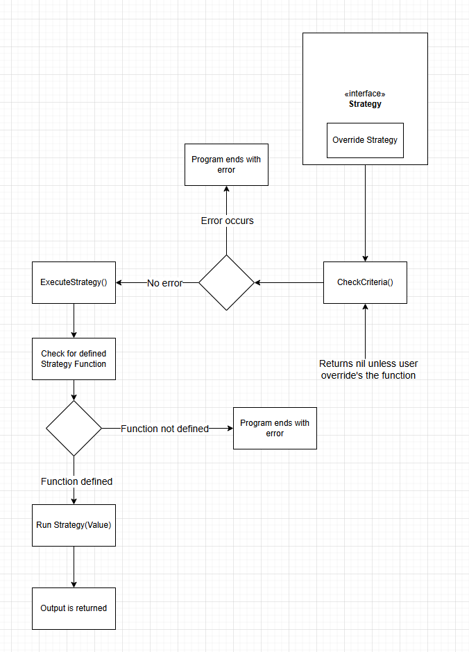
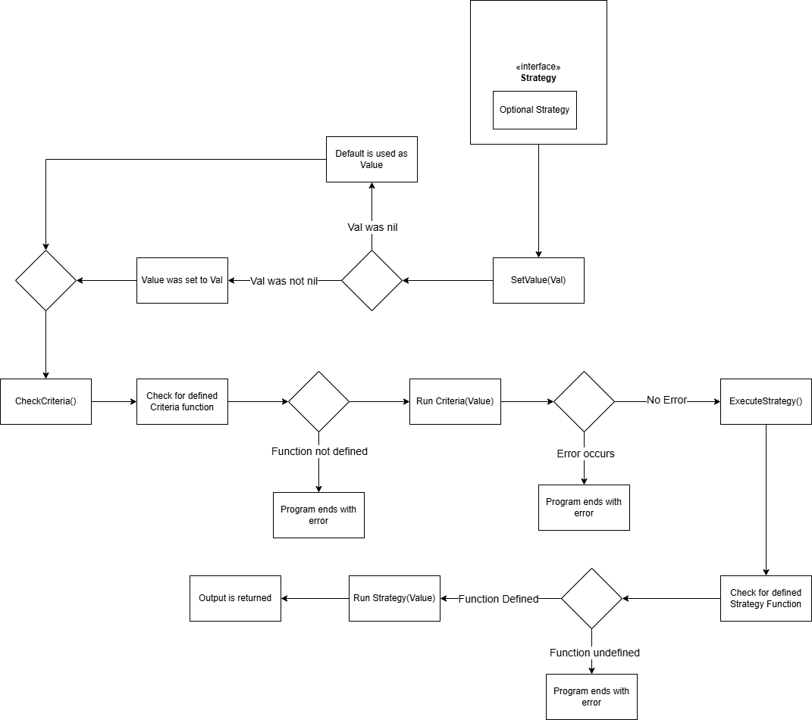
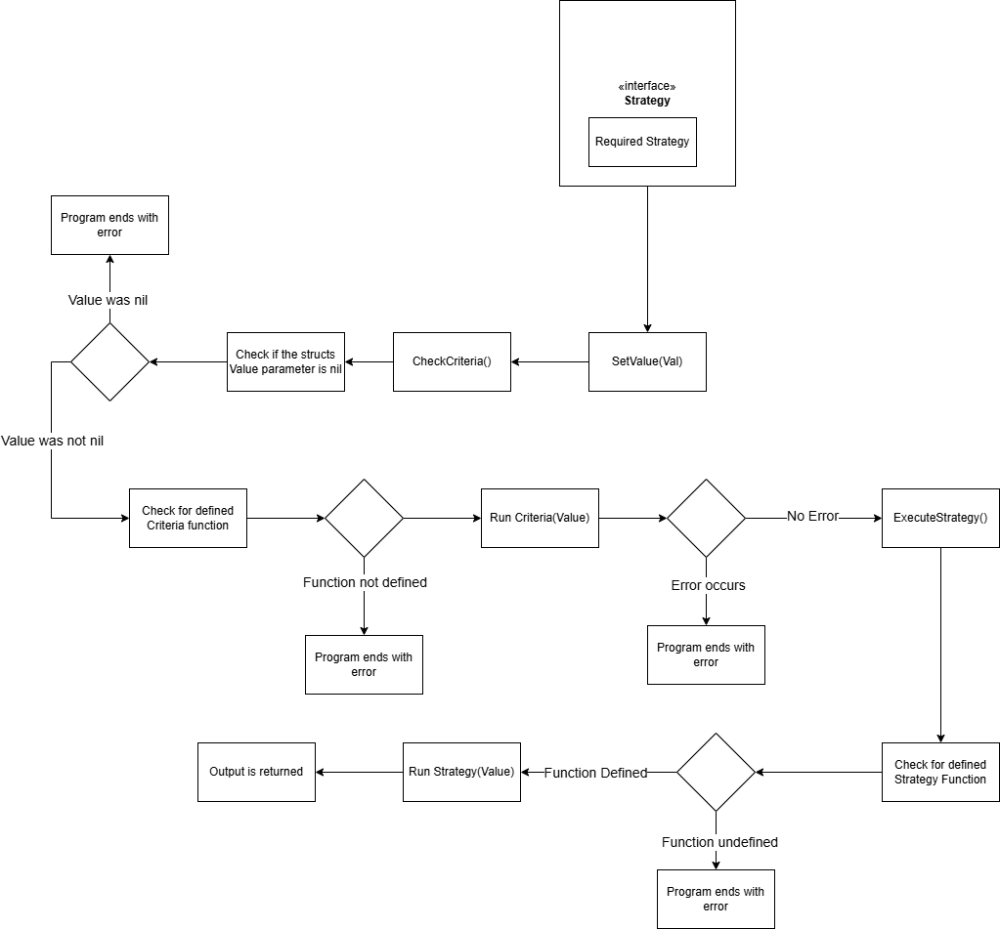

# Strategy 

## Overview

A `Strategy` is a reusable struct that must define 2 functions `CheckCriteria() error` and `ExecuteStrategy() (any, error)`.
A subset of `Strategy` is `ValueStrategy` which implements the above alongside another function, `SetValue(any)`. This allows for
a `Strategy` to set a value and rely on it for its purpose.

## Strategy Types

### Override Strategy
An `Override Strategy` is a `Strategy` that does not rely on a value. As such, it is not a `ValueStrategy`. Only one parameter is defined 
for this type which is `Strategy() (any, error)`. This function is user defined and allows the behavior to be changed to suit the user's
needs. No criteria function is set due to this type not relying on a value, as such `CheckCriteria() error` simply returns nil and skips
validation. This `Strategy` is meant to be used when you want consistent behavior regardless of the template's `value` field.
Below is the general execution flow for an `Override Strategy`.

### Optional Strategy
An `Optional Strategy` is a `Strategy` that relies on a value. As such it is a `ValueStrategy`. The parameters defined for this type of
`Strategy` are the following:
- `Strategy(val any) (any, error)`: User defined function that uses the stored value of the struct. Returns the result and any errors that 
occurred in execution. 
- `Criteria(val any) error`: User defined function which performs type checking for the stored value of type `any`. Returns an error if
the type is deemed invalid.
- `Value any`: The stored value set by the `SetValue(any)` function and is used as the input for the above functions
- `Default any`: A user defined default value to be used when the given value for `SetValue(any)` is `nil`

`Optional Strategy` should be used when a default is meant to be used when `nil` is given as the value from a template. To achieve this,
the user defines a `Default any` parameter. When `SetValue(any)` runs and is given a `nil` value, the `value` parameter is automatically
set to `Default any`. In other words `Optional Strategy` should be used when you want the option to define the behavior using the
`value` field or leave it to a default. Below is the general execution flow for an `Optional Strategy`.

### Required Strategy
A `Required Strategy` is a `Strategy` that relies on a value. As such it is a `ValueStrategy`. The parameters defined for this type of
`Strategy` are the following:
- `Strategy(val any) (any, error)`: User defined function that uses the stored value of the struct. Returns the result and any errors that 
occurred in execution. 
- `Criteria(val any) error`: User defined function which performs type checking for the stored value of type `any`. Returns an error if
the type is deemed invalid.
- `Value any`: The stored value set by the `SetValue(any)` function and is used as the input for the above functions

`Required Strategy` should be used when the struct needs a value in order to be used and as such cannot accept `nil` as one.
Even should the user defined `Criteria` function allow it, a `nil` check is performed before running the user's `Criteria` function
and will return an error if the `Value` is `nil`. Below is the general execution flow for a `Required Strategy`.

**Note:** The above diagrams aren't telling the whole story. A `Strategy` is used internally by both the `template` and `parameters` package
to help with their purposes. As such, the flows above are fragmented parts of a larger process that has been stitched together. It's more of
the lifecycle of a `Strategy`. In reality, the `template` package is actually responsible for all the steps before `ExecuteStrategy()` is called.
Then, from that point forward it's the `parameters` package that handles the rest.

## Defined Strategies
For more information on which Strategies are already defined, please read the [Existing Strategies file](Existing_Strategies.md)